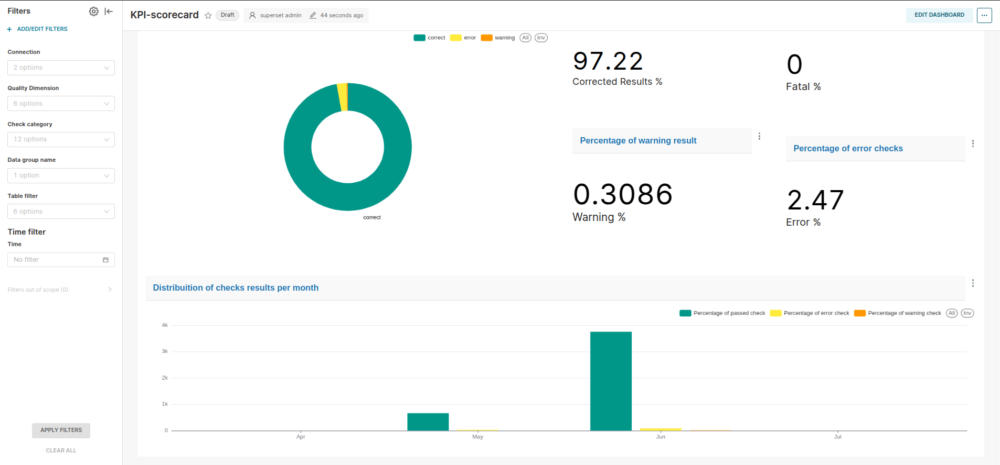

# Data quality Platform 

# 1.Description
This is the repostiory for Viettel Digital Talent Phase 1's project - Data quality platform with DQOps.

This project utilizes DQOps for data quality checks, and using Data Lakehouse architecture for storage and query engine

## 2.System architecture


## 3.Set up guildline

### Prerequisites

- [Docker](https://www.docker.com/)
- [Docker Compose](https://docs.docker.com/compose/)

### Pull DQOps docker image
```bash
docker pull dqops:latest
```

### Start dqops containter 
```bash
docker run -v ./dqops/volume:/dqo/userhome --network lakehouse_net --name dqops -it  -m=4g -p 8889:8888 dqops/dqo run
```

### Start docker compose services

```bash
docker compose up -d 
```

### Create table in hive metastore

```sql
CREATE EXTERNAL TABLE IF NOT EXISTS dq_check_results (
  id STRING,
  actual_value DOUBLE,
  expected_value DOUBLE,
  time_period TIMESTAMP_NTZ,
  time_period_utc TIMESTAMP,
  time_gradient STRING,
  grouping_level_1 STRING,
  grouping_level_2 STRING,
  grouping_level_3 STRING,
  grouping_level_4 STRING,
  grouping_level_5 STRING,
  grouping_level_6 STRING,
  grouping_level_7 STRING,
  grouping_level_8 STRING,
  grouping_level_9 STRING,
  data_group_hash BIGINT,
  data_group_name STRING,
  data_grouping_configuration STRING,
  connection_hash BIGINT,
  connection_name STRING,
  provider STRING,
  table_hash BIGINT,
  schema_name STRING,
  table_name STRING,
  table_name_pattern STRING,
  table_stage STRING,
  table_priority INT,
  column_hash BIGINT,
  column_name STRING,
  column_name_pattern STRING,
  check_hash BIGINT,
  check_name STRING,
  check_display_name STRING,
  check_type STRING,
  check_category STRING,
  table_comparison STRING,
  quality_dimension STRING,
  sensor_name STRING,
  time_series_id STRING,
  executed_at TIMESTAMP,
  duration_ms INT,
  created_at TIMESTAMP,
  updated_at TIMESTAMP,
  created_by STRING,
  updated_by STRING,
  severity STRING,
  incident_hash BIGINT,
  reference_connection STRING,
  reference_schema STRING,
  reference_table STRING,
  reference_column STRING,
  include_in_kpi BOOLEAN,
  include_in_sla BOOLEAN,
  fatal_lower_bound DOUBLE,
  fatal_upper_bound DOUBLE,
  error_lower_bound DOUBLE,
  error_upper_bound DOUBLE,
  warning_lower_bound DOUBLE,
  warning_upper_bound DOUBLE
)
USING DELTA
LOCATION 's3a://dqops/check_results/';
```

## 4.Results 




